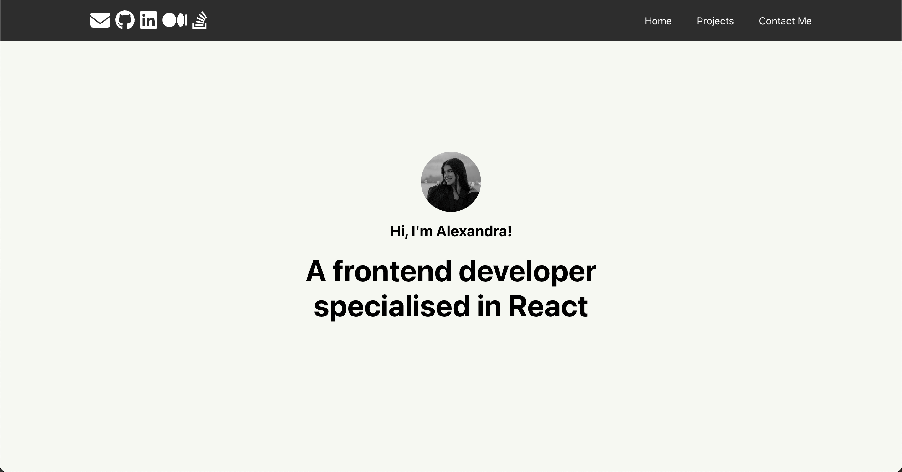
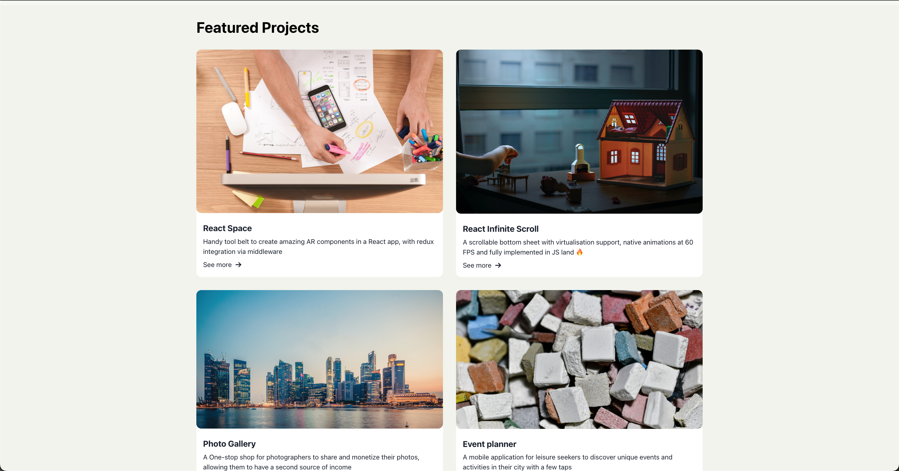
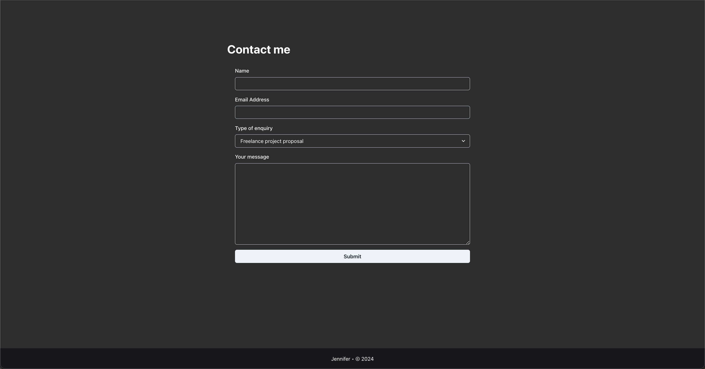

# React Mock Portfolio 🎨 💻

A modern portfolio built with React.js and styled using Chakra UI. This project showcases featured projects, a functional contact form, and smooth navigation—all designed to highlight my skills in frontend development and UX design.

---

## 📋 Features

### 🖥️ **Landing Section**

- A sleek introduction with personalized branding.
- Built with Chakra UI's customizable components.

### 🧭 **Header Navigation**

- Smooth scrolling navigation links for an engaging user experience.
- Dynamic visibility: Header hides while scrolling down and reappears when scrolling up.

### 🚀 **Projects Section**

- Highlights featured projects with detailed descriptions and images.
- Built using reusable and modular `Card` components.

### 📩 **Contact Me Form**

- Fully functional form with:
  - **Live validation** using Formik and Yup.
  - Feedback alerts integrated via the Context API.

### ⚡ **Dynamic Alerts**

- Provides success or error feedback for form submissions.
- Implements state management using Context API.

---

## 🛠️ Technologies Used

- **React.js**: Leveraging hooks for state and effects.
- **Chakra UI**: For component styling and layout.
- **Formik & Yup**: Simplifying form handling and validation.
- **FontAwesome**: Adding polished social media icons.
- **Context API**: Managing global state for alerts.

---

## 🎯 What This Project Demonstrates

- Modern frontend development techniques.
- Modular and reusable component design.
- Dynamic feedback mechanisms and form validation.
- Smooth user navigation and interaction.

---

## 📷 Screenshots

_Landing page introduction._

_Showcase of featured projects._

_Functional contact form with validation._
