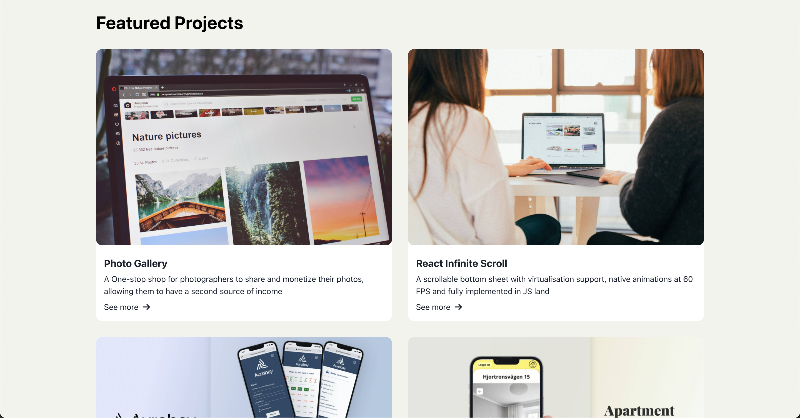
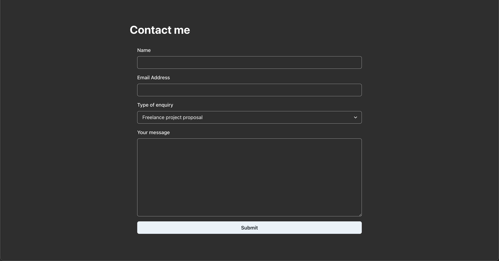

# React Mock Portfolio 🎨 💻

A mock portfolio web app built with React.js and styled using Chakra UI. This project showcases featured projects, a functional contact form, and smooth navigation.

This is a **responsive web app** designed to adapt seamlessly across **desktop**, **tablet**, and **mobile** devices, ensuring an optimal viewing experience on all screen sizes.

---

## 🚀 Live Demo

Check out the live version of the app here:  
[**Live Demo**](https://jjejja.github.io/react-mock-portfolio/)

---

## 📋 Features

### 🖥️ **Landing Section**

- A sleek introduction with personalized branding.
- Built with Chakra UI's customizable components.

### 🧭 **Header Navigation**

- Smooth scrolling navigation links for an engaging user experience.
- Dynamic visibility: Header hides while scrolling down and reappears when scrolling up.

### 🚀 **Projects Section**

- Highlights featured projects with detailed descriptions and images.
- Built using reusable and modular `Card` components.

### 📩 **Contact Me Form**

- Fully functional form with:
  - **Live validation** using Formik and Yup.
  - Feedback alerts integrated via the Context API.
  - **Simulated API Call**: When the user submits the form, a simulated API call is triggered, randomly returning either a success or error message. This is implemented using a custom hook (`useSubmit`) that simulates a network request with a 50% chance of success or failure.

### ⚡ **Dynamic Alerts**

- Provides success or error feedback for form submissions.
- Implements state management using Context API.

### 📱 **Responsive Design**

- Fully responsive layout optimized for **desktop**, **tablet**, and **mobile** screens.
- Automatically adjusts content and navigation for smaller screens to ensure a smooth, user-friendly experience on all devices.

---

## 🛠️ Technologies Used

- **React.js**: Leveraging hooks for state and effects.
- **Chakra UI**: For component styling and layout.
- **Formik & Yup**: Simplifying form handling and validation.
- **FontAwesome**: Adding polished social media icons.
- **Context API**: Managing global state for alerts.

---

## 🎯 What This Project Demonstrates

- Modern frontend development techniques.
- Modular and reusable component design.
- Dynamic feedback mechanisms and form validation.
- Smooth user navigation and interaction.
- **Responsive design** for mobile, tablet, and desktop devices.

---

## 📷 Screenshots

  
_Landing page introduction._

  
_Showcase of featured projects._

  
_Functional contact form with validation._

---

## 📧 Contact

Feel free to reach out via:

- **GitHub**: [https://github.com/JJejja](https://github.com/JJejja)
- **LinkedIn**: [https://www.linkedin.com/in/jennifer-andersson-59b2785b](https://www.linkedin.com/in/jennifer-andersson-59b2785b)

---
